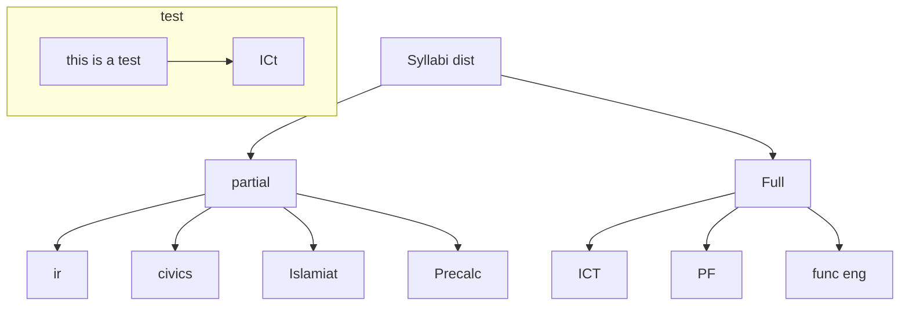

---
{"excalidraw-plugin":"parsed","tags":["excalidraw"],"excalidraw-open-md":true,"image":"Finals_marks requirement.svg","dg-publish":true,"permalink":"/100-inbox/finals-marks-requirement/","dgPassFrontmatter":true,"created":"2026-07-26T08:39:06.872+05:00","updated":"2026-05-28T22:49:19.687+05:00","dg-note-properties":{"excalidraw-plugin":"parsed","tags":["excalidraw"],"excalidraw-open-md":true,"image":"100 Inbox/Finals_marks requirement.svg"}}
---

Civics 44.125 so basically 45 9th june 
Islamic Studies 40 for 4.0 4th june
IR 42.5 if all goes as it is currently] 5th june
ICT 43.25 for 3.7 16th june
PF 44.3~25 3.33 and 39 for 3.0 22nd june
Func English 4.0 18th june
precalc 11.25 pass 20th june

<svg version="1.1" xmlns="http://www.w3.org/2000/svg" viewBox="0 0 2470.911418914795 439.99999046325684" width="2470.911418914795" height="439.99999046325684" class="excalidraw-svg"><!-- svg-source:excalidraw --><metadata></metadata><defs></defs><rect x="0" y="0" width="2470.911418914795" height="439.99999046325684" fill="#121212"></rect><g stroke-linecap="round" transform="translate(1612.8775901794434 354.99999046325684) rotate(0 54.453125 30)"><path d="M15 0 C30 -1.68, 48.6 -0.69, 93.91 0 M15 0 C41.53 1.22, 65.86 1.15, 93.91 0 M93.91 0 C103.17 0.41, 108.18 6.88, 108.91 15 M93.91 0 C103.47 0.52, 108.66 6.7, 108.91 15 M108.91 15 C107.51 26.65, 108.61 35.73, 108.91 45 M108.91 15 C108.33 23.74, 108.04 32.08, 108.91 45 M108.91 45 C109.95 54.55, 103.37 61.51, 93.91 60 M108.91 45 C110.27 56.85, 101.65 59.32, 93.91 60 M93.91 60 C70.19 58.25, 50.27 59.3, 15 60 M93.91 60 C70.95 60.15, 48.26 60.11, 15 60 M15 60 C4.23 59.23, 0.21 56, 0 45 M15 60 C3.44 57.99, 0.19 53.12, 0 45 M0 45 C-0.07 37.36, -0.82 30.59, 0 15 M0 45 C0.74 36.73, 1.21 29.95, 0 15 M0 15 C0.81 4.65, 5.81 0.06, 15 0 M0 15 C1.64 5.96, 6.79 0.78, 15 0" stroke="#d3d3d3" stroke-width="2" fill="none"></path></g><g transform="translate(1626.5407600402832 372.49999046325684) rotate(0 40.789955139160156 12.5)"><text x="40.789955139160156" y="17.619999999999997" font-family="Excalifont, Xiaolai, sans-serif, Segoe UI Emoji" font-size="20px" fill="#d3d3d3" text-anchor="middle" style="white-space: pre;" direction="ltr" dominant-baseline="alphabetic">JS-FULL</text></g><g stroke-linecap="round" transform="translate(1930.6900901794434 354.99999046325684) rotate(0 62.233070373535156 30)"><path d="M15 0 C37.65 -0.85, 57.69 1.61, 109.47 0 M15 0 C48.82 -0.31, 83.01 0.43, 109.47 0 M109.47 0 C119.08 0.45, 124.25 6.48, 124.47 15 M109.47 0 C120.14 0.84, 125.78 3.27, 124.47 15 M124.47 15 C123.89 24.94, 124.73 37.68, 124.47 45 M124.47 15 C124.8 25.29, 124.02 36.77, 124.47 45 M124.47 45 C125.65 56.61, 117.5 59.41, 109.47 60 M124.47 45 C123.92 56.86, 119.18 57.82, 109.47 60 M109.47 60 C88.68 60.13, 69.56 58.99, 15 60 M109.47 60 C83.53 59.31, 58.47 60.19, 15 60 M15 60 C3.64 58.25, 0.17 53.36, 0 45 M15 60 C3.17 58.27, -0.12 54.66, 0 45 M0 45 C-0.61 35.84, 1.74 31.03, 0 15 M0 45 C0.12 37.08, 0.12 29.54, 0 15 M0 15 C1.42 5.83, 6.56 0.68, 15 0 M0 15 C0.43 5.93, 5.3 1.15, 15 0" stroke="#d3d3d3" stroke-width="2" fill="none"></path></g><g transform="translate(1940.883213043213 372.49999046325684) rotate(0 52.039947509765625 12.5)"><text x="52.039947509765625" y="17.619999999999997" font-family="Excalifont, Xiaolai, sans-serif, Segoe UI Emoji" font-size="20px" fill="#d3d3d3" text-anchor="middle" style="white-space: pre;" direction="ltr" dominant-baseline="alphabetic">PTB-FULL</text></g><g stroke-linecap="round" transform="translate(1771.7838401794434 354.99999046325684) rotate(0 54.453125 30)"><path d="M15 0 C35.96 -2.05, 55.53 -1.31, 93.91 0 M15 0 C40.09 -0.51, 65.46 0, 93.91 0 M93.91 0 C104.5 0.73, 110.05 3.49, 108.91 15 M93.91 0 C105.94 -0.47, 110.01 4.41, 108.91 15 M108.91 15 C109.96 20.21, 110.18 28.89, 108.91 45 M108.91 15 C109.42 24.13, 107.84 31.37, 108.91 45 M108.91 45 C108.44 56.62, 103.66 58.1, 93.91 60 M108.91 45 C107 54.99, 103.21 59.69, 93.91 60 M93.91 60 C67.99 58.8, 42.59 58.94, 15 60 M93.91 60 C72.58 59.52, 52.7 59.58, 15 60 M15 60 C3.41 58.5, -0.11 54.7, 0 45 M15 60 C3.83 58.8, -1.35 54.12, 0 45 M0 45 C-1.07 40.44, 1.08 32.87, 0 15 M0 45 C0.59 36.94, 0.66 28.38, 0 15 M0 15 C0.37 5.81, 5.26 1, 15 0 M0 15 C-0.27 6.9, 5.62 -0.19, 15 0" stroke="#d3d3d3" stroke-width="2" fill="none"></path></g><g transform="translate(1785.4470100402832 372.49999046325684) rotate(0 40.789955139160156 12.5)"><text x="40.789955139160156" y="17.619999999999997" font-family="Excalifont, Xiaolai, sans-serif, Segoe UI Emoji" font-size="20px" fill="#d3d3d3" text-anchor="middle" style="white-space: pre;" direction="ltr" dominant-baseline="alphabetic">JS-FULL</text></g><g stroke-linecap="round" transform="translate(2105.1562309265137 339.99999046325684) rotate(0 177.87759399414062 45)"><path d="M22.5 0 C93.08 0.3, 164.41 0.55, 333.26 0 M22.5 0 C122.95 -1.38, 223.39 -2.18, 333.26 0 M333.26 0 C350.03 -0.41, 356.71 6.99, 355.76 22.5 M333.26 0 C346.28 0.38, 355.03 8.66, 355.76 22.5 M355.76 22.5 C355.58 32.73, 357.54 45.22, 355.76 67.5 M355.76 22.5 C355.08 40.43, 355.19 55.79, 355.76 67.5 M355.76 67.5 C354.1 82.49, 347.65 89.73, 333.26 90 M355.76 67.5 C356.24 83.79, 347.42 89.32, 333.26 90 M333.26 90 C253.63 89.29, 175.82 88.17, 22.5 90 M333.26 90 C266.58 87.64, 201 88.07, 22.5 90 M22.5 90 C6.48 88.95, -1.17 81.74, 0 67.5 M22.5 90 C5.56 91.82, 1.11 81.54, 0 67.5 M0 67.5 C-0.64 50.5, -0.23 33.32, 0 22.5 M0 67.5 C-0.16 52.53, -0.22 37.25, 0 22.5 M0 22.5 C-0.23 9.15, 8.04 -0.16, 22.5 0 M0 22.5 C0.28 6.8, 6.98 -1.2, 22.5 0" stroke="#d3d3d3" stroke-width="2" fill="none"></path></g><g transform="translate(2112.1239738464355 347.49999046325684) rotate(0 170.90985107421875 37.5)"><text x="170.90985107421875" y="17.619999999999997" font-family="Excalifont, Xiaolai, sans-serif, Segoe UI Emoji" font-size="20px" fill="#d3d3d3" text-anchor="middle" style="white-space: pre;" direction="ltr" dominant-baseline="alphabetic">PTB-9.1-</text><text x="170.90985107421875" y="42.62" font-family="Excalifont, Xiaolai, sans-serif, Segoe UI Emoji" font-size="20px" fill="#d3d3d3" text-anchor="middle" style="white-space: pre;" direction="ltr" dominant-baseline="alphabetic">no_word_problems_after_Q6,9.2,9.</text><text x="170.90985107421875" y="67.62" font-family="Excalifont, Xiaolai, sans-serif, Segoe UI Emoji" font-size="20px" fill="#d3d3d3" text-anchor="middle" style="white-space: pre;" direction="ltr" dominant-baseline="alphabetic">4</text></g><g stroke-linecap="round" transform="translate(1108.5025901794434 119.99999618530273) rotate(0 57.23958206176758 29.999998092651367)"><path d="M0 0 C30.61 0, 61.8 0.81, 114.48 0 M0 0 C39.43 0.66, 77.56 0.61, 114.48 0 M114.48 0 C115.58 11.64, 115.8 26.74, 114.48 60 M114.48 0 C114.91 17.47, 113.34 33.03, 114.48 60 M114.48 60 C80.93 58.2, 51.17 59.25, 0 60 M114.48 60 C81.33 60.34, 48.46 60.31, 0 60 M0 60 C1.23 42.95, -1.52 28.79, 0 0 M0 60 C0.42 46.76, -0.03 33.29, 0 0" stroke="#d3d3d3" stroke-width="2" fill="none"></path></g><g transform="translate(1134.2122039794922 137.4999942779541) rotate(0 31.52996826171875 12.5)"><text x="31.52996826171875" y="17.619999999999997" font-family="Excalifont, Xiaolai, sans-serif, Segoe UI Emoji" font-size="20px" fill="#d3d3d3" text-anchor="middle" style="white-space: pre;" direction="ltr" dominant-baseline="alphabetic">partial</text></g><g stroke-linecap="round" transform="translate(483.03384923934937 229.99999237060547) rotate(0 35.553382873535156 29.999998092651367)"><path d="M0 0 C21.3 0.93, 39.62 1.56, 71.11 0 M0 0 C19.02 0.35, 39.44 0.68, 71.11 0 M71.11 0 C71.03 13.82, 72.99 29.9, 71.11 60 M71.11 0 C70.28 23.63, 70.4 44.7, 71.11 60 M71.11 60 C55.39 60.2, 41.35 59.06, 0 60 M71.11 60 C51.49 59.38, 32.75 60.27, 0 60 M0 60 C-1.11 44.49, -0.98 32.05, 0 0 M0 60 C-0.28 42.52, -0.54 26.59, 0 0" stroke="#d3d3d3" stroke-width="2" fill="none"></path></g><g transform="translate(512.0272421836853 247.49999046325684) rotate(0 6.559989929199219 12.5)"><text x="6.559989929199219" y="17.619999999999997" font-family="Excalifont, Xiaolai, sans-serif, Segoe UI Emoji" font-size="20px" fill="#d3d3d3" text-anchor="middle" style="white-space: pre;" direction="ltr" dominant-baseline="alphabetic">ir</text></g><g stroke-linecap="round" transform="translate(905.7193870544434 229.99999237060547) rotate(0 54.44661331176758 29.999998092651367)"><path d="M0 0 C38.48 -0.01, 77.27 -2.68, 108.89 0 M0 0 C33.85 0.06, 69.44 -0.77, 108.89 0 M108.89 0 C110.96 14.43, 108.76 32.32, 108.89 60 M108.89 0 C107.99 22.84, 108.52 45.56, 108.89 60 M108.89 60 C73.35 58.69, 38.33 58.83, 0 60 M108.89 60 C79.72 59.67, 51.99 59.73, 0 60 M0 60 C0.15 45.75, -0.6 32.36, 0 0 M0 60 C0.99 43.88, 1.46 29.25, 0 0" stroke="#d3d3d3" stroke-width="2" fill="none"></path></g><g transform="translate(934.5260391235352 247.49999046325684) rotate(0 25.63996124267578 12.5)"><text x="25.63996124267578" y="17.619999999999997" font-family="Excalifont, Xiaolai, sans-serif, Segoe UI Emoji" font-size="20px" fill="#d3d3d3" text-anchor="middle" style="white-space: pre;" direction="ltr" dominant-baseline="alphabetic">civics</text></g><g stroke-linecap="round" transform="translate(1064.6126136779785 229.99999237060547) rotate(0 64.453125 29.999998092651367)"><path d="M0 0 C45.17 0.47, 90.69 -0.11, 128.91 0 M0 0 C46.28 1.04, 93.69 1.09, 128.91 0 M128.91 0 C130.35 11.87, 126.83 22.57, 128.91 60 M128.91 0 C128.93 18.53, 128.36 35.65, 128.91 60 M128.91 60 C95.34 59.71, 64.3 58.14, 0 60 M128.91 60 C100.69 58.19, 74.01 58.8, 0 60 M0 60 C-0.45 43.37, 1.9 31.09, 0 0 M0 60 C-0.17 44.33, -0.17 29.04, 0 0" stroke="#d3d3d3" stroke-width="2" fill="none"></path></g><g transform="translate(1089.8157768249512 247.49999046325684) rotate(0 39.249961853027344 12.5)"><text x="39.249961853027344" y="17.619999999999997" font-family="Excalifont, Xiaolai, sans-serif, Segoe UI Emoji" font-size="20px" fill="#d3d3d3" text-anchor="middle" style="white-space: pre;" direction="ltr" dominant-baseline="alphabetic">Islamiat</text></g><g stroke-linecap="round" transform="translate(1683.4374885559082 229.99999237060547) rotate(0 63.346351623535156 29.999998092651367)"><path d="M0 0 C35.21 1.81, 67.53 0.23, 126.69 0 M0 0 C46.61 -1.31, 94.94 -0.21, 126.69 0 M126.69 0 C126.11 16.66, 125.85 34.94, 126.69 60 M126.69 0 C126.02 21.03, 126.09 42.32, 126.69 60 M126.69 60 C85.62 59.31, 46.39 57.55, 0 60 M126.69 60 C97.69 59.29, 69.13 59.43, 0 60 M0 60 C-1.31 48.97, 0.85 34.93, 0 0 M0 60 C0.47 43.46, 0.54 26.42, 0 0" stroke="#d3d3d3" stroke-width="2" fill="none"></path></g><g transform="translate(1712.42387008667 247.49999046325684) rotate(0 34.35997009277344 12.5)"><text x="34.35997009277344" y="17.619999999999997" font-family="Excalifont, Xiaolai, sans-serif, Segoe UI Emoji" font-size="20px" fill="#d3d3d3" text-anchor="middle" style="white-space: pre;" direction="ltr" dominant-baseline="alphabetic">Precalc</text></g><g stroke-linecap="round" transform="translate(1999.0234184265137 119.99999618530273) rotate(0 46.11328125 29.999998092651367)"><path d="M0 0 C33.98 1.43, 66.54 -1.72, 92.23 0 M0 0 C24.83 -1.7, 49.08 -0.75, 92.23 0 M92.23 0 C93.26 15.46, 91.55 31.46, 92.23 60 M92.23 0 C92.1 16.54, 91.32 31.2, 92.23 60 M92.23 60 C62.28 59.16, 35.03 58.25, 0 60 M92.23 60 C68.54 60.44, 47.02 59.23, 0 60 M0 60 C-0.74 37.07, -0.33 13.95, 0 0 M0 60 C-0.28 39.9, -0.34 19.49, 0 0" stroke="#d3d3d3" stroke-width="2" fill="none"></path></g><g transform="translate(2028.5467109680176 137.4999942779541) rotate(0 16.589988708496094 12.5)"><text x="16.589988708496094" y="17.619999999999997" font-family="Excalifont, Xiaolai, sans-serif, Segoe UI Emoji" font-size="20px" fill="#d3d3d3" text-anchor="middle" style="white-space: pre;" direction="ltr" dominant-baseline="alphabetic">Full</text></g><g stroke-linecap="round" transform="translate(1860.1301918029785 229.99999237060547) rotate(0 46.11328125 29.999998092651367)"><path d="M0 0 C32.54 0.43, 67.87 0.66, 92.23 0 M0 0 C18.61 -0.13, 38.03 0.56, 92.23 0 M92.23 0 C91.4 15.05, 91.28 31.84, 92.23 60 M92.23 0 C91.9 20.18, 91.02 41.24, 92.23 60 M92.23 60 C64.01 58.36, 37.12 57.84, 0 60 M92.23 60 C58.2 60.28, 22.67 59.44, 0 60 M0 60 C0.81 41.14, 0.66 19.54, 0 0 M0 60 C-0.19 40.4, 0.19 19.06, 0 0" stroke="#d3d3d3" stroke-width="2" fill="none"></path></g><g transform="translate(1885.9334907531738 247.49999046325684) rotate(0 20.309982299804688 12.5)"><text x="20.309982299804688" y="17.619999999999997" font-family="Excalifont, Xiaolai, sans-serif, Segoe UI Emoji" font-size="20px" fill="#d3d3d3" text-anchor="middle" style="white-space: pre;" direction="ltr" dominant-baseline="alphabetic">ICT</text></g><g stroke-linecap="round" transform="translate(2002.3567523956299 229.99999237060547) rotate(0 42.779945373535156 29.999998092651367)"><path d="M0 0 C21.75 -1.55, 47.3 -0.5, 85.56 0 M0 0 C24.14 -0.77, 48.54 -0.8, 85.56 0 M85.56 0 C86.33 14.33, 83.58 31.54, 85.56 60 M85.56 0 C85.03 12.94, 84.57 25.66, 85.56 60 M85.56 60 C66.49 60.24, 43.41 61.19, 0 60 M85.56 60 C54.64 59.88, 23.62 60.27, 0 60 M0 60 C0.61 37.59, 0.8 14.43, 0 0 M0 60 C-0.04 36.75, -0.39 13.59, 0 0" stroke="#d3d3d3" stroke-width="2" fill="none"></path></g><g transform="translate(2031.546709060669 247.49999046325684) rotate(0 13.589988708496094 12.5)"><text x="13.589988708496094" y="17.619999999999997" font-family="Excalifont, Xiaolai, sans-serif, Segoe UI Emoji" font-size="20px" fill="#d3d3d3" text-anchor="middle" style="white-space: pre;" direction="ltr" dominant-baseline="alphabetic">PF</text></g><g stroke-linecap="round" transform="translate(2137.916645050049 229.99999237060547) rotate(0 68.36588287353516 29.999998092651367)"><path d="M0 0 C29.42 0.83, 60.49 -0.31, 136.73 0 M0 0 C36.59 0.06, 74.06 0.95, 136.73 0 M136.73 0 C134.57 12.33, 134.71 27.73, 136.73 60 M136.73 0 C135.84 16.72, 135.58 35, 136.73 60 M136.73 60 C90.44 62.12, 41.15 62.11, 0 60 M136.73 60 C96.05 60.91, 54 60.97, 0 60 M0 60 C1.35 41.76, -0.46 22.69, 0 0 M0 60 C-0.37 42.85, 1.12 28.2, 0 0" stroke="#d3d3d3" stroke-width="2" fill="none"></path></g><g transform="translate(2165.352565765381 247.49999046325684) rotate(0 40.929962158203125 12.5)"><text x="40.929962158203125" y="17.619999999999997" font-family="Excalifont, Xiaolai, sans-serif, Segoe UI Emoji" font-size="20px" fill="#d3d3d3" text-anchor="middle" style="white-space: pre;" direction="ltr" dominant-baseline="alphabetic">func eng</text></g><g stroke-linecap="round" transform="translate(1644.811185836792 10) rotate(0 77.79947662353516 29.999998092651367)"><path d="M0 0 C49.36 -0.34, 99.24 -0.2, 155.6 0 M0 0 C40.03 -1.65, 81.51 -1.59, 155.6 0 M155.6 0 C154.85 12.21, 154.1 25.3, 155.6 60 M155.6 0 C155.58 15.29, 156.05 32.08, 155.6 60 M155.6 60 C102.65 62.05, 50.4 62.18, 0 60 M155.6 60 C103.77 61.13, 51.57 61.45, 0 60 M0 60 C-0.56 39.94, -0.99 19.77, 0 0 M0 60 C-0.75 47.65, -1.57 35.7, 0 0" stroke="#d3d3d3" stroke-width="2" fill="none"></path></g><g transform="translate(1669.3907146453857 27.499998092651367) rotate(0 53.219947814941406 12.5)"><text x="53.219947814941406" y="17.619999999999997" font-family="Excalifont, Xiaolai, sans-serif, Segoe UI Emoji" font-size="20px" fill="#d3d3d3" text-anchor="middle" style="white-space: pre;" direction="ltr" dominant-baseline="alphabetic">Syllabi dist</text></g><g stroke-linecap="round" transform="translate(10 354.99999046325684) rotate(0 91.70572662353516 29.999998092651367)"><path d="M0 0 C45.9 0.92, 94.34 -0.65, 183.41 0 M0 0 C38.22 0.75, 77.98 1.35, 183.41 0 M183.41 0 C182.33 13.25, 184.68 30.84, 183.41 60 M183.41 0 C184.39 15.32, 184.39 31.02, 183.41 60 M183.41 60 C116.01 61.8, 48.05 61.69, 0 60 M183.41 60 C119.48 61.43, 55.14 61.21, 0 60 M0 60 C-1.64 45.34, 1.43 26.42, 0 0 M0 60 C-0.12 44.2, 1.33 25.58, 0 0" stroke="#d3d3d3" stroke-width="2" fill="none"></path></g><g transform="translate(35.095794677734375 372.4999885559082) rotate(0 66.60993194580078 12.5)"><text x="66.60993194580078" y="17.619999999999997" font-family="Excalifont, Xiaolai, sans-serif, Segoe UI Emoji" font-size="20px" fill="#d3d3d3" text-anchor="middle" style="white-space: pre;" direction="ltr" dominant-baseline="alphabetic">foreign_policy</text></g><g stroke-linecap="round" transform="translate(243.4114532470703 354.99999046325684) rotate(0 98.37239074707031 29.999998092651367)"><path d="M0 0 C59.33 1.51, 120.52 -0.25, 196.74 0 M0 0 C43.73 -0.23, 87.9 -0.09, 196.74 0 M196.74 0 C196.39 14.85, 198.54 26.69, 196.74 60 M196.74 0 C197.7 17.38, 197.76 34.26, 196.74 60 M196.74 60 C135.06 60.02, 73.03 60.79, 0 60 M196.74 60 C139.11 58.88, 81.42 58.43, 0 60 M0 60 C-0.74 34.12, -0.33 10.75, 0 0 M0 60 C-1.23 36.62, -0.65 12.98, 0 0" stroke="#d3d3d3" stroke-width="2" fill="none"></path></g><g transform="translate(261.43392181396484 372.4999885559082) rotate(0 80.34992218017578 12.5)"><text x="80.34992218017578" y="17.619999999999997" font-family="Excalifont, Xiaolai, sans-serif, Segoe UI Emoji" font-size="20px" fill="#d3d3d3" text-anchor="middle" style="white-space: pre;" direction="ltr" dominant-baseline="alphabetic">Theories_of_IR</text></g><g stroke-linecap="round" transform="translate(490.15623474121094 354.99999046325684) rotate(0 211.796875 29.999998092651367)"><path d="M0 0 C129.87 1.72, 261.17 1.24, 423.59 0 M0 0 C104.48 1.27, 210.09 0.63, 423.59 0 M423.59 0 C423.64 24.54, 424.06 48.89, 423.59 60 M423.59 0 C424.25 20.91, 424.19 41.51, 423.59 60 M423.59 60 C301.39 60.73, 179.03 60.36, 0 60 M423.59 60 C319.07 58.12, 213.43 57.72, 0 60 M0 60 C1.98 49.38, -1.68 34.23, 0 0 M0 60 C-0.61 39.1, -0.28 17.72, 0 0" stroke="#d3d3d3" stroke-width="2" fill="none"></path></g><g transform="translate(502.27333068847656 372.4999885559082) rotate(0 199.67977905273438 12.5)"><text x="199.67977905273438" y="17.619999999999997" font-family="Excalifont, Xiaolai, sans-serif, Segoe UI Emoji" font-size="20px" fill="#d3d3d3" text-anchor="middle" style="white-space: pre;" direction="ltr" dominant-baseline="alphabetic">Internation_and_Regional_Organizations</text></g><g stroke-linecap="round" transform="translate(963.7499847412109 354.99999046325684) rotate(0 188.4375 29.999998092651367)"><path d="M0 0 C110.39 0.45, 221.58 0.14, 376.88 0 M0 0 C143.52 1.35, 286.13 0.85, 376.88 0 M376.88 0 C377.73 21.97, 377.57 41.2, 376.88 60 M376.88 0 C376.84 21.25, 377.22 40.77, 376.88 60 M376.88 60 C258.53 58.87, 140.26 60.67, 0 60 M376.88 60 C242.24 59.54, 108.37 60.14, 0 60 M0 60 C1.61 37.15, 2.22 13.64, 0 0 M0 60 C0.61 38.93, 0.55 19.3, 0 0" stroke="#d3d3d3" stroke-width="2" fill="none"></path></g><g transform="translate(984.5076446533203 372.4999885559082) rotate(0 167.67984008789062 12.5)"><text x="167.67984008789062" y="17.619999999999997" font-family="Excalifont, Xiaolai, sans-serif, Segoe UI Emoji" font-size="20px" fill="#d3d3d3" text-anchor="middle" style="white-space: pre;" direction="ltr" dominant-baseline="alphabetic">Dimnsions_and_Balance_of_Power</text></g><g stroke-linecap="round" transform="translate(1390.624984741211 354.99999046325684) rotate(0 34.453125 30)"><path d="M15 0 C25.98 1.29, 32.95 2.24, 53.91 0 M15 0 C29.65 0.1, 44.2 0.48, 53.91 0 M53.91 0 C65.46 0.68, 69.28 5.81, 68.91 15 M53.91 0 C64.2 1.15, 68.64 6.9, 68.91 15 M68.91 15 C68.27 24.35, 67.84 33.6, 68.91 45 M68.91 15 C69.05 20.87, 68.22 27.15, 68.91 45 M68.91 45 C67.49 56.98, 65.39 58.33, 53.91 60 M68.91 45 C67.11 56.28, 63.45 61.97, 53.91 60 M53.91 60 C45.85 60.58, 35.35 60.45, 15 60 M53.91 60 C39.87 60.99, 25.79 60.5, 15 60 M15 60 C6.94 58.86, -1.93 53.85, 0 45 M15 60 C5.22 60.28, -0.57 53.78, 0 45 M0 45 C-1.53 32.79, 1.52 23.1, 0 15 M0 45 C-0.16 35.82, 0.04 25.15, 0 15 M0 15 C-0.05 3.56, 5.03 -0.09, 15 0 M0 15 C-1.38 6.58, 4.94 -1.19, 15 0" stroke="#d3d3d3" stroke-width="2" fill="none"></path></g><g transform="translate(1401.9181289672852 372.49999046325684) rotate(0 23.15998077392578 12.5)"><text x="23.15998077392578" y="17.619999999999997" font-family="Excalifont, Xiaolai, sans-serif, Segoe UI Emoji" font-size="20px" fill="#d3d3d3" text-anchor="middle" style="white-space: pre;" direction="ltr" dominant-baseline="alphabetic">PTB</text></g><g stroke-linecap="round" transform="translate(1509.531234741211 354.99999046325684) rotate(0 26.67317771911621 30)"><path d="M13.34 0 C23.95 0.56, 31.57 0.55, 40.01 0 M13.34 0 C22.2 0.23, 29.7 0.29, 40.01 0 M40.01 0 C49.16 1, 53.11 6.09, 53.35 13.34 M40.01 0 C49.52 -0.19, 53.63 3.75, 53.35 13.34 M53.35 13.34 C51.22 24.55, 54.29 31.5, 53.35 46.66 M53.35 13.34 C52.31 23.65, 53.76 31.15, 53.35 46.66 M53.35 46.66 C51.78 56.67, 48.5 61.71, 40.01 60 M53.35 46.66 C51.67 56.56, 47.97 60.91, 40.01 60 M40.01 60 C32.16 59.46, 23.72 59.8, 13.34 60 M40.01 60 C31.21 59.48, 19.51 59.47, 13.34 60 M13.34 60 C4.64 60.24, -0.5 54.5, 0 46.66 M13.34 60 C5.54 58.77, 0.15 53.61, 0 46.66 M0 46.66 C0.39 39.16, 0.7 32.13, 0 13.34 M0 46.66 C-0.02 33.45, 0.03 21.62, 0 13.34 M0 13.34 C-1.2 5.82, 4.39 -1.03, 13.34 0 M0 13.34 C1.41 6.13, 5.98 -1.79, 13.34 0" stroke="#d3d3d3" stroke-width="2" fill="none"></path></g><g transform="translate(1524.2944240570068 372.49999046325684) rotate(0 11.909988403320312 12.5)"><text x="11.909988403320312" y="17.619999999999997" font-family="Excalifont, Xiaolai, sans-serif, Segoe UI Emoji" font-size="20px" fill="#d3d3d3" text-anchor="middle" style="white-space: pre;" direction="ltr" dominant-baseline="alphabetic">JS</text></g><g stroke-linecap="round"><g transform="translate(1108.503 155.36500190734864) rotate(0 -316.301421469975 34.77759714085608)"><path d="M0.48 0.04 C-97.78 8.43, -490.82 38.39, -589.06 50.14 C-687.31 61.89, -588.88 67.13, -588.98 70.54 M-0.72 -0.99 C-99.11 7.06, -491.47 36.71, -589.56 48.28 C-687.65 59.84, -589.3 65.07, -589.26 68.41" stroke="#d3d3d3" stroke-width="2" fill="none"></path></g><g transform="translate(1108.503 155.36500190734864) rotate(0 -316.301421469975 34.77759714085608)"><path d="M-599.38 70.01 C-595.9 70.15, -592.05 69.68, -589.26 68.41 M-599.38 70.01 C-595.94 69.69, -592.68 69.32, -589.26 68.41" stroke="#d3d3d3" stroke-width="2" fill="none"></path></g><g transform="translate(1108.503 155.36500190734864) rotate(0 -316.301421469975 34.77759714085608)"><path d="M-598.04 63.13 C-595.02 65.62, -591.64 67.49, -589.26 68.41 M-598.04 63.13 C-595.03 65.11, -592.22 67.04, -589.26 68.41" stroke="#d3d3d3" stroke-width="2" fill="none"></path></g></g><mask></mask><g stroke-linecap="round"><g transform="translate(1108.503 165.81400190734863) rotate(0 -79.1265393538722 29.944543905176225)"><path d="M0.85 0.5 C-23.79 7.09, -122.57 29.65, -147.4 39.59 C-172.23 49.54, -147.98 56.72, -148.11 60.17 M-0.16 -0.28 C-24.92 5.94, -123.09 27.96, -147.86 37.68 C-172.63 47.41, -148.76 54.69, -148.76 58.08" stroke="#d3d3d3" stroke-width="2" fill="none"></path></g><g transform="translate(1108.503 165.81400190734863) rotate(0 -79.1265393538722 29.944543905176225)"><path d="M-158.25 54.22 C-154.6 56.26, -151.45 56.97, -148.76 58.08 M-158.25 54.22 C-155.08 55.91, -151.65 56.76, -148.76 58.08" stroke="#d3d3d3" stroke-width="2" fill="none"></path></g><g transform="translate(1108.503 165.81400190734863) rotate(0 -79.1265393538722 29.944543905176225)"><path d="M-153.55 49.02 C-151.49 52.87, -149.94 55.34, -148.76 58.08 M-153.55 49.02 C-151.97 52.5, -150.14 55.13, -148.76 58.08" stroke="#d3d3d3" stroke-width="2" fill="none"></path></g></g><mask></mask><g stroke-linecap="round"><g transform="translate(1145.737 180.50000190734863) rotate(0 -8.88622349352157 22.540833047707565)"><path d="M0.43 0.19 C-2.4 4.27, -13.73 17.21, -16.57 24.72 C-19.41 32.24, -16.57 41.82, -16.6 45.28 M-0.02 -0.19 C-2.94 3.7, -14.13 16.45, -16.95 23.87 C-19.76 31.3, -16.96 40.91, -16.91 44.35" stroke="#d3d3d3" stroke-width="2" fill="none"></path></g><g transform="translate(1145.737 180.50000190734863) rotate(0 -8.88622349352157 22.540833047707565)"><path d="M-21.57 35.22 C-19.65 38.69, -17.89 42.05, -16.91 44.35 M-21.57 35.22 C-19.88 38.38, -18.28 41.52, -16.91 44.35" stroke="#d3d3d3" stroke-width="2" fill="none"></path></g><g transform="translate(1145.737 180.50000190734863) rotate(0 -8.88622349352157 22.540833047707565)"><path d="M-14.61 34.36 C-15.27 38.17, -16.09 41.85, -16.91 44.35 M-14.61 34.36 C-15.36 37.85, -16.2 41.29, -16.91 44.35" stroke="#d3d3d3" stroke-width="2" fill="none"></path></g></g><mask></mask><g stroke-linecap="round"><g transform="translate(1222.982 155.91800190734864) rotate(0 280.7644470764816 35.13287328491359)"><path d="M0.22 0.49 C87.39 8.7, 436.72 38, 523.96 49.68 C611.2 61.36, 523.63 67.27, 523.66 70.57 M-1.12 -0.31 C85.83 7.52, 435.77 36.37, 523.09 47.87 C610.41 59.38, 522.58 64.97, 522.82 68.75" stroke="#d3d3d3" stroke-width="2" fill="none"></path></g><g transform="translate(1222.982 155.91800190734864) rotate(0 280.7644470764816 35.13287328491359)"><path d="M531.35 63.07 C528.56 65.36, 525.44 67.26, 522.82 68.75 M531.35 63.07 C528.17 65.08, 524.73 67.14, 522.82 68.75" stroke="#d3d3d3" stroke-width="2" fill="none"></path></g><g transform="translate(1222.982 155.91800190734864) rotate(0 280.7644470764816 35.13287328491359)"><path d="M533.01 69.88 C529.57 69.6, 525.82 68.92, 522.82 68.75 M533.01 69.88 C529.17 69.28, 525.1 68.74, 522.82 68.75" stroke="#d3d3d3" stroke-width="2" fill="none"></path></g></g><mask></mask><g stroke-linecap="round"><g transform="translate(1999.023 168.76000190734862) rotate(0 -50.212098140134515 28.88857689529658)"><path d="M0.16 0.6 C-15.37 6.72, -77.48 27.89, -92.92 37.23 C-108.36 46.57, -92.51 53.45, -92.46 56.64 M-1.22 -0.13 C-16.94 5.63, -78.64 25.95, -93.94 35.63 C-109.25 45.3, -93.33 54.3, -93.05 57.91" stroke="#d3d3d3" stroke-width="2" fill="none"></path></g><g transform="translate(1999.023 168.76000190734862) rotate(0 -50.212098140134515 28.88857689529658)"><path d="M-101.45 52.03 C-98.24 53.77, -95.23 56.04, -93.05 57.91 M-101.45 52.03 C-99.11 53.5, -96.8 54.99, -93.05 57.91" stroke="#d3d3d3" stroke-width="2" fill="none"></path></g><g transform="translate(1999.023 168.76000190734862) rotate(0 -50.212098140134515 28.88857689529658)"><path d="M-95.71 48.01 C-94.31 51.04, -93.13 54.59, -93.05 57.91 M-95.71 48.01 C-95.04 50.64, -94.41 53.29, -93.05 57.91" stroke="#d3d3d3" stroke-width="2" fill="none"></path></g></g><mask></mask><g stroke-linecap="round"><g transform="translate(2045.137 180.50000190734863) rotate(0 -0.30625069710134767 22.778595066368577)"><path d="M-0.06 0.45 C-0.05 4.48, 0.13 17.06, 0.15 24.45 C0.17 31.85, 0.11 41.46, 0.07 44.83 M-0.76 0.21 C-0.81 4.31, -0.29 17.61, -0.21 25.13 C-0.12 32.65, -0.27 42.02, -0.25 45.35" stroke="#d3d3d3" stroke-width="2" fill="none"></path></g><g transform="translate(2045.137 180.50000190734863) rotate(0 -0.30625069710134767 22.778595066368577)"><path d="M-3.72 35.7 C-2.19 38.86, -1.56 41.8, -0.25 45.35 M-3.72 35.7 C-2.92 38.06, -1.6 41.06, -0.25 45.35" stroke="#d3d3d3" stroke-width="2" fill="none"></path></g><g transform="translate(2045.137 180.50000190734863) rotate(0 -0.30625069710134767 22.778595066368577)"><path d="M3.29 35.73 C2.63 38.87, 1.06 41.81, -0.25 45.35 M3.29 35.73 C2.2 38.06, 1.63 41.05, -0.25 45.35" stroke="#d3d3d3" stroke-width="2" fill="none"></path></g></g><mask></mask><g stroke-linecap="round"><g transform="translate(2091.25 166.23900190734864) rotate(0 61.30467644344628 29.2154362668395)"><path d="M0.32 -0.1 C19.54 6.14, 96.11 28.61, 115.18 38.4 C134.25 48.19, 114.89 55.35, 114.76 58.64 M-0.97 -1.2 C18.12 5.12, 95.17 29.61, 114.31 39.74 C133.45 49.88, 113.84 56.49, 113.85 59.63" stroke="#d3d3d3" stroke-width="2" fill="none"></path></g><g transform="translate(2091.25 166.23900190734864) rotate(0 61.30467644344628 29.2154362668395)"><path d="M118.12 50.31 C116.88 53.13, 115.42 55.46, 113.85 59.63 M118.12 50.31 C117.52 52.86, 115.88 54.78, 113.85 59.63" stroke="#d3d3d3" stroke-width="2" fill="none"></path></g><g transform="translate(2091.25 166.23900190734864) rotate(0 61.30467644344628 29.2154362668395)"><path d="M123.11 55.23 C120.39 56.65, 117.5 57.56, 113.85 59.63 M123.11 55.23 C121.3 56.52, 118.42 57.22, 113.85 59.63" stroke="#d3d3d3" stroke-width="2" fill="none"></path></g></g><mask></mask><g stroke-linecap="round"><g transform="translate(1644.811 48.18400190734863) rotate(0 -257.9411671286474 32.623985649228096)"><path d="M0.15 -0.36 C-79.8 7.35, -399.37 35.11, -479.34 46.19 C-559.31 57.28, -479.92 62.51, -479.68 66.15 M-1.23 -1.6 C-81.39 6.27, -400.51 35.99, -480.43 47.4 C-560.35 58.81, -480.72 63.79, -480.76 66.85" stroke="#d3d3d3" stroke-width="2" fill="none"></path></g><g transform="translate(1644.811 48.18400190734863) rotate(0 -257.9411671286474 32.623985649228096)"><path d="M-490.93 68.14 C-487.92 67.48, -484.82 66.77, -480.76 66.85 M-490.93 68.14 C-488.96 67.72, -487.33 67.57, -480.76 66.85" stroke="#d3d3d3" stroke-width="2" fill="none"></path></g><g transform="translate(1644.811 48.18400190734863) rotate(0 -257.9411671286474 32.623985649228096)"><path d="M-489.38 61.31 C-486.88 62.87, -484.29 64.4, -480.76 66.85 M-489.38 61.31 C-487.66 62.28, -486.34 63.5, -480.76 66.85" stroke="#d3d3d3" stroke-width="2" fill="none"></path></g></g><mask></mask><g stroke-linecap="round"><g transform="translate(1800.41 53.76700190734863) rotate(0 132.093018935538 30.88831851752103)"><path d="M-0.27 -0.62 C40.39 6.11, 203.09 29.56, 244.12 40.06 C285.15 50.57, 245.84 58.83, 245.91 62.4 M1.78 1.66 C42.83 8.53, 205.85 31.19, 246.51 40.99 C287.17 50.78, 246.07 56.83, 245.77 60.41" stroke="#d3d3d3" stroke-width="2" fill="none"></path></g><g transform="translate(1800.41 53.76700190734863) rotate(0 132.093018935538 30.88831851752103)"><path d="M252.86 53.01 C250.09 54.79, 247.41 58.63, 245.77 60.41 M252.86 53.01 C249.82 55.63, 247.44 58.77, 245.77 60.41" stroke="#d3d3d3" stroke-width="2" fill="none"></path></g><g transform="translate(1800.41 53.76700190734863) rotate(0 132.093018935538 30.88831851752103)"><path d="M255.96 59.31 C252.24 59.11, 248.59 60.98, 245.77 60.41 M255.96 59.31 C251.83 59.68, 248.34 60.58, 245.77 60.41" stroke="#d3d3d3" stroke-width="2" fill="none"></path></g></g><mask></mask><g stroke-linecap="round"><g transform="translate(483.034 265.1910019073486) rotate(0 -204.01474991828036 42.54375329510123)"><path d="M-0.61 -1.17 C-63.92 7.35, -316.66 36.1, -380.15 50.48 C-443.63 64.85, -381.12 79.26, -381.52 85.07 M1.27 0.83 C-62.07 9.05, -316.53 34.47, -380.47 48.71 C-444.41 62.94, -381.98 79.97, -382.38 86.26" stroke="#d3d3d3" stroke-width="2" fill="none"></path></g><g transform="translate(483.034 265.1910019073486) rotate(0 -204.01474991828036 42.54375329510123)"><path d="M-399.49 81.52 C-396.5 84.67, -389.04 83.96, -382.38 86.26 M-399.49 81.52 C-395.38 83.72, -389.3 83.43, -382.38 86.26" stroke="#d3d3d3" stroke-width="2" fill="none"></path></g><g transform="translate(483.034 265.1910019073486) rotate(0 -204.01474991828036 42.54375329510123)"><path d="M-392.44 71.63 C-391.46 77.49, -385.95 79.51, -382.38 86.26 M-392.44 71.63 C-390.4 76.6, -386.3 79.08, -382.38 86.26" stroke="#d3d3d3" stroke-width="2" fill="none"></path></g></g><mask></mask><g stroke-linecap="round"><g transform="translate(483.034 271.56000190734864) rotate(0 -75.57197170653097 40.11916360825299)"><path d="M1.18 0.67 C-22.29 8.06, -117.5 30.15, -141.44 43.2 C-165.37 56.24, -142.32 72.79, -142.43 78.95 M0.34 -0.03 C-23.25 7.65, -119.07 31.23, -142.49 44.61 C-165.9 57.99, -140.18 74.67, -140.15 80.27" stroke="#d3d3d3" stroke-width="2" fill="none"></path></g><g transform="translate(483.034 271.56000190734864) rotate(0 -75.57197170653097 40.11916360825299)"><path d="M-154.31 69.56 C-149.9 71.81, -147.71 73.01, -140.15 80.27 M-154.31 69.56 C-149.48 71.89, -146.57 76.34, -140.15 80.27" stroke="#d3d3d3" stroke-width="2" fill="none"></path></g><g transform="translate(483.034 271.56000190734864) rotate(0 -75.57197170653097 40.11916360825299)"><path d="M-144.12 62.96 C-142.31 66.96, -142.67 69.81, -140.15 80.27 M-144.12 62.96 C-142.39 67.38, -142.55 73.81, -140.15 80.27" stroke="#d3d3d3" stroke-width="2" fill="none"></path></g></g><mask></mask><g stroke-linecap="round"><g transform="translate(554.141 271.1640019073486) rotate(0 79.16464498503149 39.554574173308914)"><path d="M-0.19 -0.24 C24.05 6.95, 122.11 30.38, 146.63 43.84 C171.16 57.3, 146.62 74.78, 146.96 80.52 M-1.75 -1.41 C22.74 5.93, 123.53 32.01, 148.73 45.38 C173.92 58.75, 149.29 73.22, 149.41 78.8" stroke="#d3d3d3" stroke-width="2" fill="none"></path></g><g transform="translate(554.141 271.1640019073486) rotate(0 79.16464498503149 39.554574173308914)"><path d="M153.26 61.48 C151.46 66.63, 150.29 74.02, 149.41 78.8 M153.26 61.48 C151.16 68.85, 150.14 76.03, 149.41 78.8" stroke="#d3d3d3" stroke-width="2" fill="none"></path></g><g transform="translate(554.141 271.1640019073486) rotate(0 79.16464498503149 39.554574173308914)"><path d="M163.49 68 C157.58 70.54, 152.33 75.33, 149.41 78.8 M163.49 68 C157.26 72.69, 152.16 77.27, 149.41 78.8" stroke="#d3d3d3" stroke-width="2" fill="none"></path></g></g><mask></mask><g stroke-linecap="round"><g transform="translate(554.141 263.58600190734865) rotate(0 321.23874991759976 42.83094075781106)"><path d="M-1.18 0.01 C98.38 8.81, 497.18 38.28, 597.19 52.6 C697.21 66.92, 598.95 80.08, 598.94 85.91 M0.4 -1.04 C100.36 7.49, 499.75 36.48, 599.46 51.1 C699.17 65.73, 599.07 80.99, 598.64 86.7" stroke="#d3d3d3" stroke-width="2" fill="none"></path></g><g transform="translate(554.141 263.58600190734865) rotate(0 321.23874991759976 42.83094075781106)"><path d="M612 75.01 C608.18 76.94, 606.13 82.84, 598.64 86.7 M612 75.01 C608.84 78.38, 605.48 80.53, 598.64 86.7" stroke="#d3d3d3" stroke-width="2" fill="none"></path></g><g transform="translate(554.141 263.58600190734865) rotate(0 321.23874991759976 42.83094075781106)"><path d="M616.38 86.33 C611.35 85, 608.05 87.68, 598.64 86.7 M616.38 86.33 C612.36 87.27, 608.06 86.98, 598.64 86.7" stroke="#d3d3d3" stroke-width="2" fill="none"></path></g></g><mask></mask><g stroke-linecap="round"><g transform="translate(1683.937 271.3300019073486) rotate(0 -138.3525450325541 40.551479759253574)"><path d="M-0.85 1.19 C-43.65 8.3, -214.8 29.47, -257.97 42.67 C-301.13 55.86, -259.65 74, -259.85 80.34 M0.9 0.77 C-41.87 7.99, -215.39 30.75, -258.45 43.68 C-301.51 56.61, -257.35 72.51, -257.45 78.35" stroke="#d3d3d3" stroke-width="2" fill="none"></path></g><g transform="translate(1683.937 271.3300019073486) rotate(0 -138.3525450325541 40.551479759253574)"><path d="M-274.07 71.46 C-268.94 74.3, -268.87 72.95, -257.45 78.35 M-274.07 71.46 C-268.83 74.16, -262.62 76.57, -257.45 78.35" stroke="#d3d3d3" stroke-width="2" fill="none"></path></g><g transform="translate(1683.937 271.3300019073486) rotate(0 -138.3525450325541 40.551479759253574)"><path d="M-265.76 62.38 C-262.3 66.99, -263.91 67.47, -257.45 78.35 M-265.76 62.38 C-263.49 68.38, -260.24 74.02, -257.45 78.35" stroke="#d3d3d3" stroke-width="2" fill="none"></path></g></g><mask></mask><g stroke-linecap="round"><g transform="translate(1683.937 277.04500190734865) rotate(0 -79.3234917963029 36.989413870647546)"><path d="M0.89 -1 C-23.75 5.23, -123.85 25.96, -148.67 38.62 C-173.49 51.29, -148.03 69.01, -148.02 74.98 M-0.1 1.08 C-24.29 7.48, -121.65 24.83, -146.45 36.85 C-171.25 48.87, -148.51 67.29, -148.91 73.18" stroke="#d3d3d3" stroke-width="2" fill="none"></path></g><g transform="translate(1683.937 277.04500190734865) rotate(0 -79.3234917963029 36.989413870647546)"><path d="M-161.85 60.67 C-160.27 62.03, -154.8 65.94, -148.91 73.18 M-161.85 60.67 C-157.32 65.79, -151.63 69.87, -148.91 73.18" stroke="#d3d3d3" stroke-width="2" fill="none"></path></g><g transform="translate(1683.937 277.04500190734865) rotate(0 -79.3234917963029 36.989413870647546)"><path d="M-150.78 55.28 C-151.68 57.96, -148.75 63.1, -148.91 73.18 M-150.78 55.28 C-150.55 62.53, -149.14 68.69, -148.91 73.18" stroke="#d3d3d3" stroke-width="2" fill="none"></path></g></g><mask></mask><g stroke-linecap="round"><g transform="translate(1703.946 290.50000190734863) rotate(0 -19.629864889414733 30.499679736830288)"><path d="M-0.94 0.67 C-7.23 5.09, -30.76 15.47, -36.86 25.53 C-42.96 35.59, -37.49 55.12, -37.54 61.03 M0.77 -0.03 C-5.78 4.17, -31.95 14.11, -37.93 23.95 C-43.91 33.78, -35.23 52.56, -35.1 58.96" stroke="#d3d3d3" stroke-width="2" fill="none"></path></g><g transform="translate(1703.946 290.50000190734863) rotate(0 -19.629864889414733 30.499679736830288)"><path d="M-44.61 43.68 C-40.18 49.11, -36.08 53.88, -35.1 58.96 M-44.61 43.68 C-41.07 48.51, -37.86 54.67, -35.1 58.96" stroke="#d3d3d3" stroke-width="2" fill="none"></path></g><g transform="translate(1703.946 290.50000190734863) rotate(0 -19.629864889414733 30.499679736830288)"><path d="M-32.57 41.14 C-32.66 47.43, -33.07 53.15, -35.1 58.96 M-32.57 41.14 C-33.18 46.89, -34.11 53.92, -35.1 58.96" stroke="#d3d3d3" stroke-width="2" fill="none"></path></g></g><mask></mask><g stroke-linecap="round"><g transform="translate(1790.622 290.50000190734863) rotate(0 18.623830376044282 30.748412568159402)"><path d="M-0.24 1.03 C5.71 5.09, 28.86 15.04, 34.74 25.03 C40.63 35.02, 34.87 55.15, 35.08 60.97 M-1.83 0.52 C4.58 4.16, 31.02 13.46, 37 23.18 C42.98 32.91, 34.15 52.61, 34.06 58.88" stroke="#d3d3d3" stroke-width="2" fill="none"></path></g><g transform="translate(1790.622 290.50000190734863) rotate(0 18.623830376044282 30.748412568159402)"><path d="M31.49 41.07 C33.7 43.71, 33.52 48.25, 34.06 58.88 M31.49 41.07 C32.7 47.64, 33.02 53.93, 34.06 58.88" stroke="#d3d3d3" stroke-width="2" fill="none"></path></g><g transform="translate(1790.622 290.50000190734863) rotate(0 18.623830376044282 30.748412568159402)"><path d="M43.54 43.58 C43.07 45.65, 40.21 49.62, 34.06 58.88 M43.54 43.58 C40.65 49.25, 36.88 54.69, 34.06 58.88" stroke="#d3d3d3" stroke-width="2" fill="none"></path></g></g><mask></mask><g stroke-linecap="round"><g transform="translate(1810.63 274.6550019073486) rotate(0 97.36756135858406 38.31272351264956)"><path d="M-0.87 0.53 C29.47 7.16, 151.22 28.27, 181.81 40.82 C212.4 53.37, 182.56 69.79, 182.69 75.82 M0.87 -0.24 C31.03 6.55, 150.39 26.09, 180.61 38.95 C210.82 51.8, 181.75 70.89, 182.16 76.87" stroke="#d3d3d3" stroke-width="2" fill="none"></path></g><g transform="translate(1810.63 274.6550019073486) rotate(0 97.36756135858406 38.31272351264956)"><path d="M185.82 59.24 C185.74 63.42, 184.63 69.75, 182.16 76.87 M185.82 59.24 C184.65 64.55, 183.87 68.9, 182.16 76.87" stroke="#d3d3d3" stroke-width="2" fill="none"></path></g><g transform="translate(1810.63 274.6550019073486) rotate(0 97.36756135858406 38.31272351264956)"><path d="M196.29 65.72 C193.22 68.01, 189.18 72.53, 182.16 76.87 M196.29 65.72 C192.42 69.42, 188.95 72.12, 182.16 76.87" stroke="#d3d3d3" stroke-width="2" fill="none"></path></g></g><mask></mask><g stroke-linecap="round"><g transform="translate(1810.63 266.99700190734865) rotate(0 253.70336876654255 34.68333700061587)"><path d="M-0.48 0.47 C78.47 8.3, 393.99 35.95, 472.85 47.48 C551.71 59.02, 472.84 65.93, 472.69 69.69 M1.46 -0.32 C80.37 7.62, 393.69 37.41, 472.13 48.74 C550.58 60.08, 472.14 64.5, 472.12 67.71" stroke="#d3d3d3" stroke-width="2" fill="none"></path></g><g transform="translate(1810.63 266.99700190734865) rotate(0 253.70336876654255 34.68333700061587)"><path d="M480.94 62.02 C479.38 63.67, 476.5 64.89, 472.12 67.71 M480.94 62.02 C477.7 64.47, 474.45 66.25, 472.12 67.71" stroke="#d3d3d3" stroke-width="2" fill="none"></path></g><g transform="translate(1810.63 266.99700190734865) rotate(0 253.70336876654255 34.68333700061587)"><path d="M482.53 69.02 C480.58 69.07, 477.34 68.7, 472.12 67.71 M482.53 69.02 C478.75 68.99, 474.93 68.26, 472.12 67.71" stroke="#d3d3d3" stroke-width="2" fill="none"></path></g></g><mask></mask></svg>

# Excalidraw Data

## Text Elements
JS-FULL
{ #Ydf1JuGF}

PTB-FULL
{ #lZqNo5Za}

JS-FULL
{ #S0K8WVN7}

PTB-9.1-no_word_problems_after_Q6,9.2,9.4
{ #A5jw3OfN}

partial
{ #SKqi6RFX}

ir
{ #09TpLZRX}

civics
{ #AaNYkrpc}

Islamiat
{ #gkfpbaGy}

Precalc
{ #zhSHdQvE}

Full
{ #qvozSjYm}

ICT
{ #w0Qf540a}

PF
{ #849rOIMh}

func eng
{ #xUFPat7S}

Syllabi dist
{ #E9uTsNu8}

foreign_policy
{ #LdY8mGan}

Theories_of_IR
{ #sdlWbA8y}

Internation_and_Regional_Organizations
{ #qJOZSn4T}

Dimnsions_and_Balance_of_Power
{ #Hp1I27u5}

PTB
{ #lYQUIOvJ}

JS
{ #aAeqRTsN}

